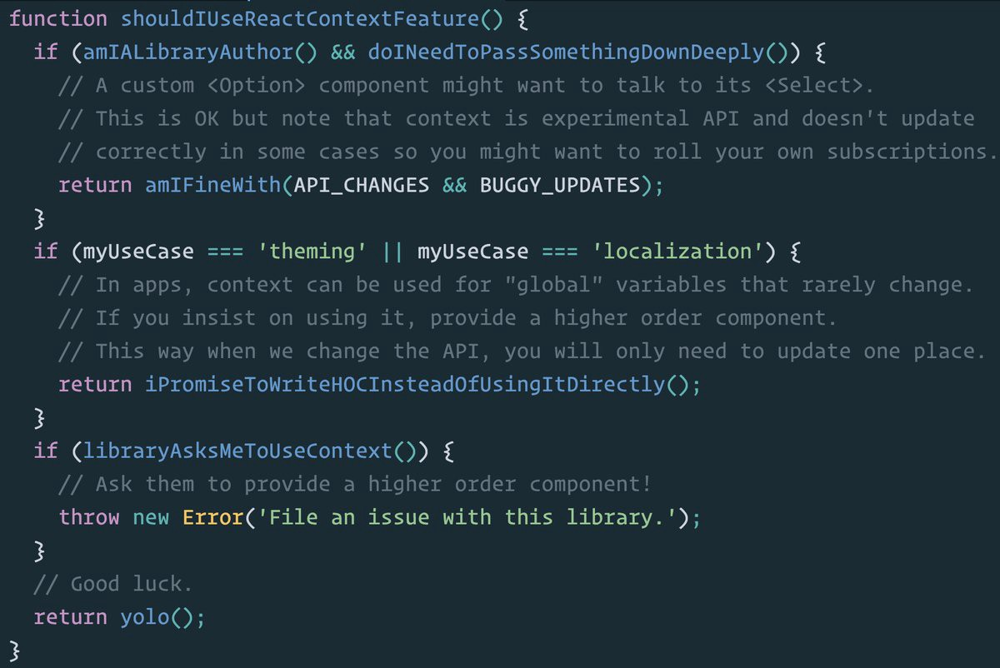

# How to safely use React context

这篇文章是 [Mobx](https://cn.mobx.js.org/) 的作者**Michel Weststrate**于2016年发表的一篇文章，原文出自 [这里](https://medium.com/@mweststrate/how-to-safely-use-react-context-b7e343eff076)，主要探讨了context在React中的角色，以及如何安全的使用它。

 [Dan Abramov](https://medium.com/@dan_abramov) 对于context的使用规则进行了非常明智的概括，具体如下：



但有时候，即便遵循了以上规则，却还是可能遇到麻烦，例如组合使用一些用到context的第三方类库，比如 [react-router](https://github.com/ReactTraining/react-router) ，  [react-redux](https://github.com/reactjs/react-redux) ，或是  [mobx-react](https://github.com/mobxjs/mobx-react) ，甚至自定义的  _shouldComponentUpdate_  或者由  _React.PureComponent_ 提供的组件。

### 为什么Context + ShouldComponentUpdate易出现问题？

context的作用我们可以自行查阅 [官方文档](https://reactjs.org/docs/context.html#passing-info-automatically-through-a-tree) ，这里不再赘述。

_shouldComponentUpdate_ \(SCU\) 可以缩短渲染的过程，例如当 _props_ 或者 _state_   没有发生有效变化时，则停止后续渲染。但是这里不仅会阻断渲染，还会导致阻塞context的传播。

作者举了个相关的例子：

```javascript
const TODOS = ["Get coffee", "Eat cookies"]

class TodoList extends React.PureComponent {
  render() {
    return (<ul>
      {this.props.todos.map(todo => 
        <li key={todo}><ThemedText>{todo}</ThemedText></li>
      )}
    </ul>)
  }
}

class App extends React.Component {
  constructor(p, c) {
    super(p, c)
    this.state = { color: "blue" } 
  }

  render() {
    return <ThemeProvider color={this.state.color}>
      <button onClick={this.makeRed.bind(this)}>
      	<ThemedText>Red please!</ThemedText>
      </button>
      <TodoList todos={TODOS} />
    </ThemeProvider>
  }
  
  makeRed() {
    this.setState({ color: "red" })
  }
}

class ThemeProvider extends React.Component {
  getChildContext() {
    return {color: this.props.color}
  }

  render() {
    return <div>{this.props.children}</div>
  }
}
ThemeProvider.childContextTypes = {
  color: React.PropTypes.string
}

class ThemedText extends React.Component {
  render() {
    return <div style={{color: this.context.color}}>
      {this.props.children}
    </div>
  }
}
ThemedText.contextTypes = {
  color: React.PropTypes.string
}

ReactDOM.render(
  <App />,
  document.getElementById("container")
)
```

这个例子很好的展示了context和SCU之间的问题点，当点击按钮时，尽管按钮获取了新的color值，但由于 _TodoList_ 组件是一个 _PureComponent ，_也就是说会执行 _shouldComponentUpdate_ 方法，而由于传入的props未发生变化，因此_TodoList_ 组件不会重新渲染，从而导致无法有效的刷新颜色。


总而言之， _shouldComponentUpdate_ 返回  _false_ 导致所有context的跟新不在向子组建传递。

### ShouldComponentUpdate 和 Context 可以一起使用！

仔细观察问题的共性可以发现，只要当我们更新context时，该问题才会出现，换句话说，日过我们不再更新context，那么问题也就不会出现了。归纳为两点：

1. Context应该是不可变的
2. 组件应该只接收一次context；可以是在初始化的时候


我们不应该将state直接存储在context中。换而言之，我们应该使用context作为一个依赖注入系统。


### 通过基于context的依赖注入进行变更通讯

那么，现在我们应该如何来更改我们的主题颜色呢？很简单，我们已经有了一个依赖注入系统\(DI\)，所以我们可以向下传递一个store来管理并监听我们的主题。我们并没有传递一个新的store，但需要保证该store本身是有状态的，并且可以将变更通知给组件：

```javascript
// Theme stores the state of the current theme, and allows components to subscribe to future changes
class Theme {
  constructor(color) {
    this.color = color
    this.subscriptions = []
  }
  
  setColor(color) {
    this.color = color
    this.subscriptions.forEach(f => f())
  }

  subscribe(f) {
    this.subscriptions.push(f)
  }
}

class ThemeProvider extends React.Component {
  constructor(p, c) {
    super(p, c)
    // theme provider uses the same Theme object
    // during it's entire lifecycle
    this.theme = new Theme(this.props.color)
  }

  // update theme whenever needed. This propagate changes to subscribed components
  componentWillReceiveProps(next) {
    this.theme.setColor(next.color)
  }

  getChildContext() {
    return {theme: this.theme}
  }

  render() {
    return <div>{this.props.children}</div>
  }
}
ThemeProvider.childContextTypes = {
  theme: React.PropTypes.object
}

class ThemedText extends React.Component {
  componentDidMount() {
    // subscribe to future theme changes
    this.context.theme.subscribe(() => this.forceUpdate())
  }
  render() {
    return <div style={{color: this.context.theme.color}}>
      {this.props.children}
    </div>
  }
}
ThemedText.contextTypes = {
  theme: React.PropTypes.object
}
```

