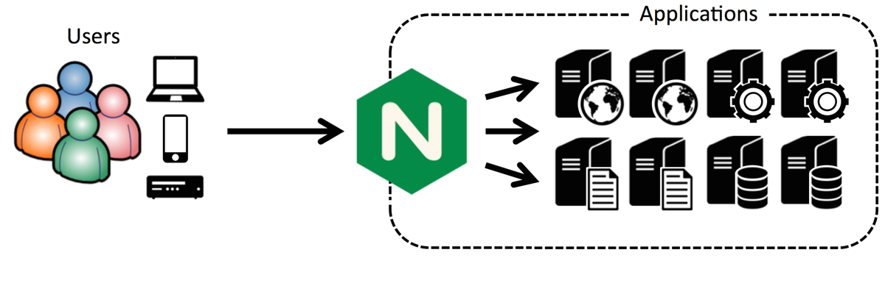
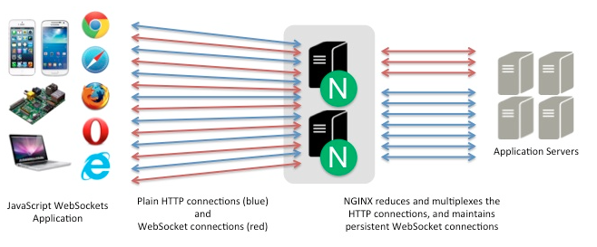
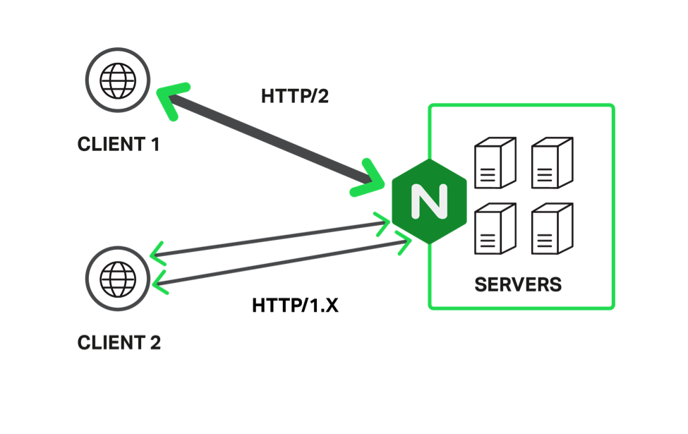

# Performance Tips for Node.js Applications

这是来自[Nginx官网](https://www.nginx.com/)上的一篇文章，对于如何使用Nginx来提升Node.js服务的性能做了精要的阐述。原文来自[这里](https://www.nginx.com/blog/5-performance-tips-for-node-js-applications/)。

Node.js具有使用单线程和非阻塞I/O，这样的特性能够让它可以支持上万等级的并发量。这样看来Node.js似乎原生解决了 nginx 被发明出来所要解决的[C10K问](https://en.wikipedia.org/wiki/C10k_problem)。因此Node.js也以其高性能和高开发效率而广为人知。

那么，可能产生生么问题呢？

这主要也是Node.js本身的一些缺陷所导致的，容易引起应用的性能降低甚至崩溃。并且，这些问题会随着访问量的增大而越来越频繁。

尽管Node.js很适合创建和运行应用的核心业务逻辑。但是它对于提供静态资源\(图片和JavaScript文件\)服务却不是很擅长。此外，对于多服务器的负载均衡也无法提供高效的支持。

而这些Node.js的弱点，我们都可以通过引入Nginx来弥补，主要包括以下几个方面：

1. **Implement a Reverse Proxy Server**
2. **Cache Static Files**
3. **Load balance traffic across multiple servers**
4. **Proxy WebSocket connections**
5. **Implement SSL/TLS and HTTP/2**

**Note:** 一个快速提高Node.js应用性能的方式是修改Node.js配置项来获取多核服务的优势。可以查阅 [the Node.js documentation](https://nodejs.org/api/child_process.html#child_process_child_process) 来学习如何让Node.js分离出和web服务器上CPU相同数量的子进程，这回极大的提高Node.js应用的性能。

### 执行一个反向代理服务

web服务不应该成为Node.js存在的理由，这无疑会放大Node.js的弱点。如果你有一个高流量的网站，要想提高性能，第一步所要考虑的就是在Node.js服务之前设置一个反向代理。这可以保护Node.js服务不会直接暴露在网络流量\( Internet traffic \)下，并且在多服务环境下可以允许你灵活的处理负载均衡和内容缓存。



[使用nginx作为Node.js的反向代理服务器](http://www.nikola-breznjak.com/blog/javascript/nodejs/using-nginx-as-a-reverse-proxy-in-front-of-your-node-js-application/)有以下优势：

1. 简化权限处理和端口分配
2. 更高效的静态图片服务
3. 成功管理Node.js崩溃问题
4. 减轻[DoS攻击](https://baike.baidu.com/item/DoS%E6%94%BB%E5%87%BB)

Note：如果想知道如何使用nginx实现Node.js服务的反向代理，可以参考以下教程：  [Ubuntu 14.04](https://www.digitalocean.com/community/tutorials/how-to-set-up-a-node-js-application-for-production-on-ubuntu-14-04) 或者[CentOS](https://www.digitalocean.com/community/tutorials/how-to-set-up-a-node-js-application-for-production-on-centos-7) 。

### 缓存静态资源文件

随着Node.js服务的成长，该服务器将开始出现一些痛点，因此有两件事你会迫切想要去做：

1. 充分利用Node.js服务器
2. 轻松增加服务器以及实现服务器之间的负载均衡

这两点在通过nginx实现了反向代理之后都会变得很容易实现。

有一篇文章中进行了分析，在作者的Node.js网站未引入nginx时，可以支持每秒900个请求的访问量，而引入nginx后，每秒可以支持超过1600个访问，也就是说性能提升了接近一倍。

下面是该文章中用于web网站配置的代码实例:

```text
server {
    listen 80;
    server_name static-test-47242.onmodulus.net;

    root /mnt/app;
    index index.html index.htm;

    location /static/ {
        try_files $uri $uri/ =404;
    }

    location /api/ {
        proxy_pass http://node-test-45750.onmodulus.net;
    }
}
```

该文章详细的阐述了如何缓存其运行在 Ghost 平台上的个人博客的静态资源，尽管一些细节是 Ghost 平台所特有的，但还是可以重用其中很多的代码到别的Node.js应用。

在nginx的**location**代码块中，你可能希望让某些资源不被缓存，例如博客平台的管理界面。下面的配置代码可以禁用 Ghost 平台的管理界面：

```text
location ~ ^/(?:ghost|signout) { 
    proxy_set_header X-Real-IP $remote_addr;
    proxy_set_header Host $http_host;
    proxy_pass http://ghost_upstream;
    add_header Cache-Control "no-cache, private, no-store,
    must-revalidate, max-stale=0, post-check=0, pre-check=0";
}
```

想要详细了解如何提供静态资源服务，可以参见  [NGINX Plus Admin Guide](https://www.nginx.com/resources/admin-guide/serving-static-content/)。

在nginx服务上缓存静态资源文件极大的减轻了Node.js应用服务的负担，让其能够获取更高的性能。

### 实现Node.js负载均衡

提高Node.js应用性能的一个关键就是运行多个服务，并实现这些服务的负载均衡。

Node.js的负载均衡可能会非常棘手，因为Node.js允许运行于浏览器端和服务端的JavaScript代码间的高度交互，并以JSON对象作为交换的媒介。这意味着一个给定的客户端session会在一个特定的服务器上不断运行，并且session持久层本身很难通过多个应用服务器获取。

因此，我们可以通过使用nginx和nginx+来实现多Node.js服务的负载均衡。两者的区别可自行查阅。

### 代理websocket连接

[websocket](https://zh.wikipedia.org/wiki/WebSocket)是一种在单个[TCP](https://zh.wikipedia.org/wiki/TCP)连接上进行[全双工](https://zh.wikipedia.org/wiki/%E5%85%A8%E9%9B%99%E5%B7%A5)通信的协议。 WebSocket使得客户端和服务器之间的数据交换变得更加简单，允许服务端主动向客户端推送数据。在WebSocket API中，浏览器和服务器只需要完成一次握手，两者之间就直接可以创建持久性的连接，并进行双向数据传输。

Node.js通常使用 Socket.IO 来实现websocket服务。但这会使得80端口\(for HTTP\)或者443端口\(for HTTPS\)变得拥挤，解决的方案很接单，就是为 Socket.IO 服务设置代理。



下面的代码是一个监听5000端口的Node服务。它是作为一个代理服务器而非web服务，并且将请求路由到合适的端口。

```javascript
var io = require('socket.io').listen(5000);

io.sockets.on('connection', function (socket) {
  socket.on('set nickname', function (name) {
    socket.set('nickname', name, function () {
      socket.emit('ready');
    });
  });

  socket.on('msg', function () {
    socket.get('nickname', function (err, name) {
      console.log('Chat message by ', name);
    });
  });
});
```

在index.html文件中，增加如下代码来连接到服务器，并且实例化一个服务器和用户浏览器之间的WebSocket。

```markup
<script src="/socket.io/socket.io.js"></script>
<script>// <![CDATA[
     var socket = io(); // your initialization code here.
// ]]>
</script>
```

完整的说明，包括nginx配置，可以查看 [这里](https://www.nginx.com/blog/nginx-nodejs-websockets-socketio/) ，也可以参考[配置 Nginx 反向代理 WebSocket](https://www.hi-linux.com/posts/42176.html) 。

### 执行SSL/TLS和HTTP/2

越来越多的站点开始使用SSL/TLS来提高用户接口的安全性，而nginx也为此提供了两种方案：

1. 如果你使用nginx实现了反向代理，可以在nginx中实现一个SSL/TLS连接到客户端。Node.js服务通过nginx反向代理来回的发送和接收未加密的请求和内容。
2. 使用  [HTTP/2](https://www.nginx.com/blog/7-tips-for-faster-http2-performance/)，可以极大的抵消使用SSL/TLS所导致的性能开销。



Nginx 下实现 HTTP/2 服务器推送 \(Server Push\) 可以参考 [这里](https://www.hi-linux.com/posts/9911.html) 。

### 总结

本文介绍了Node.js服务存在的一些缺陷，以及如何通过nginx的结合来实现高性能的应用。我们可以结合自身需要对服务进行改造，以其更好的实现我们的实际需求。

